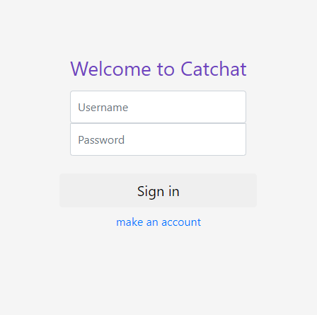
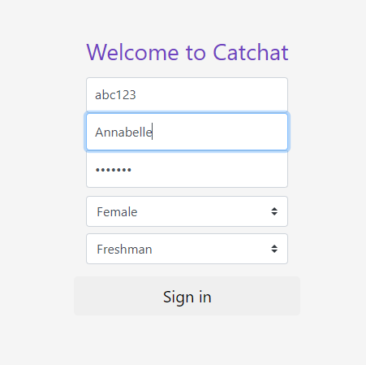
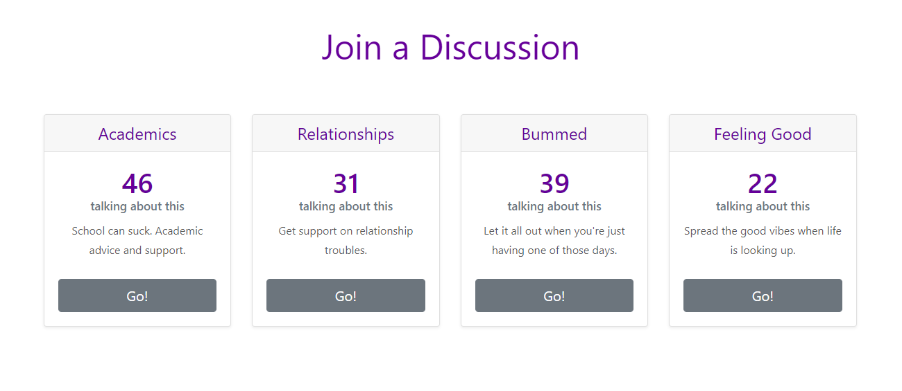
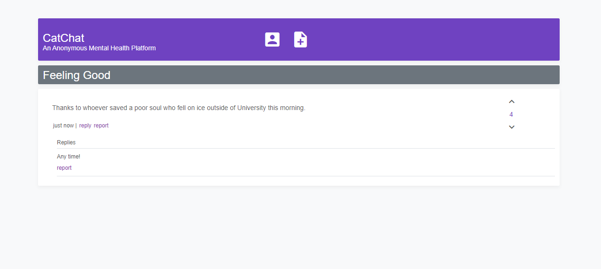
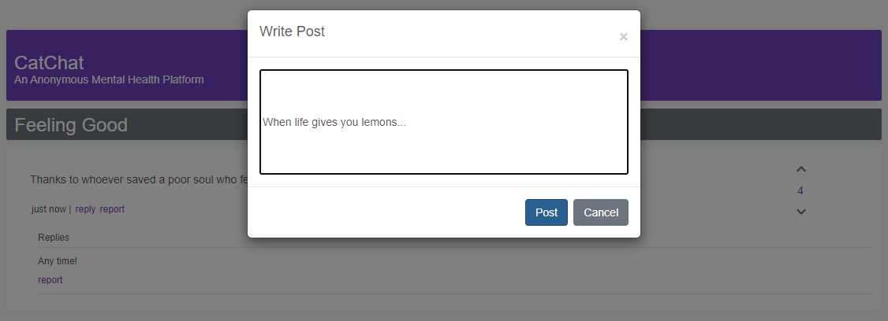
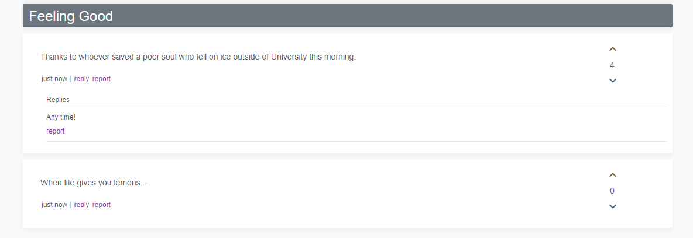

# CatChat
#### *Project for CS 330 - Human Computer Interaction*

## An anonymous discussion forum for Northwestern students regarding mental health topics.

&nbsp;

## **Background and Context**

### Slide deck for **problem statement**, **background research**, and **paper prototyping**. 

> ### https://docs.google.com/presentation/d/1Bish-54XwT0j9OecXiPL2XumkdeHV4qmBtHX2BA5Njw/edit?usp=sharing

&nbsp;

## **Final Presentation** 

### Slide deck for **user testing findings**, **user stories and features**, and **final interface demo**.

> ### https://docs.google.com/presentation/d/1hEfxeEChvspTtb74NxA8sxZ-23R1u120cZEXdSsoMmQ/edit?usp=sharing

&nbsp;

## **Demo**

### **Prototype Link:** 
> ### https://xunchuan-liu.github.io/CatChat/

&nbsp;

### Sign in to CatChat or make a new account. 

> 

**Note:** *User authentication is not implemented for this prototype - passwords are not saved. Choose to create a new account to sign in.*

&nbsp;

&nbsp;

### Fill out profile fields to sign in. Your name will **not** be displayed in any online forums. 

&nbsp;

&nbsp;

### Browse the discussion forums and choose one to join. 

> 

&nbsp;

&nbsp;

### Welcome to the discussion board. Post replies, upvote/downvote posts, and report inappropriate posts. 

&nbsp;

&nbsp;

### Select the ***+*** to write a new post. 

